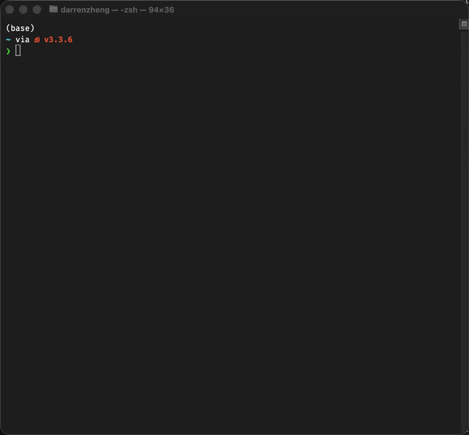

<div align="center">
  
</div>

# Clear Mind

[中文文档](README_CN.md)

<div align="center">
  
</div>

**You and an AI co-manage one Obsidian vault — with crystal-clear boundaries.**

Clear Mind reads your notes, understands who you are, and grows alongside you. It remembers your patterns, tracks your growth, and suggests entropy reduction. But it **never touches your notes** — all its writing is confined to its own folder, enforced at the code level.

This is not another AI that dumps files into your vault. Clear Mind is a disciplined co-manager that knows its place.

## Core Philosophy: Co-manage, Don't Pollute

Most AI tools write files everywhere, cluttering your carefully curated vault. Clear Mind is different:

```
Your Obsidian Vault
├── daily-notes/       ← Your notes. Sacred. Read-only for the agent.
├── projects/          ← The agent observes, understands, but NEVER modifies.
├── ideas/             ← Your creative space remains yours.
│
└── _clear_mind/       ← Agent's space. Only here it writes.
    ├── about_user.md      Growing understanding of you
    ├── entropy_log.md     Entropy reduction observations
    ├── reflections/       Daily reflections on what changed
    └── ...
```

**The boundary is not just a prompt — it's enforced in code:**

- `write_agent_note` and `append_agent_note` validate the path starts with `_clear_mind/`
- Path traversal attempts are blocked (`../../etc/passwd` → rejected)
- The agent has zero write tools that operate outside `_clear_mind/`
- Even if the LLM "decides" to write elsewhere, the tool layer refuses

**What the agent DOES do:**

- Read your notes to understand your thinking, projects, and patterns
- Build a growing profile in `_clear_mind/about_user.md` — so it remembers you across sessions
- Write daily reflections in `_clear_mind/reflections/` — tracking what changed and what it means
- Log entropy reduction opportunities in `_clear_mind/entropy_log.md` — suggestions, never actions

**What the agent NEVER does:**

- Modify, delete, or rearrange your notes
- Create files outside `_clear_mind/`
- Act on suggestions without your explicit consent

## Features

- **Local-first** — runs on LM Studio, Ollama, or any OpenAI-compatible API. Zero cloud dependency.
- **Obsidian CLI integration** — uses the official Obsidian CLI (v1.12+) for all vault operations
- **Hard boundary enforcement** — the agent physically cannot write outside `_clear_mind/`, enforced at the tool level, not just the prompt
- **Heartbeat monitoring** — daily vault change detection with zero token cost when nothing changed
- **Incremental growth** — `about_user.md` grows with every interaction, building real institutional memory

## Quick Start

### Prerequisites

- Python 3.12+
- [Obsidian](https://obsidian.md) desktop app running (v1.12+ with CLI enabled)
- A local LLM server (e.g. [LM Studio](https://lmstudio.ai), [Ollama](https://ollama.com))

### Install

```bash
git clone https://github.com/yourusername/clear-mind.git
cd clear-mind
pip install -e .
```

### Setup

```bash
clear-mind init
```

Interactive setup will ask for:
1. Your Obsidian vault path
2. LLM API base URL (default: `http://localhost:1234/v1`)
3. API key (default: `lm-studio`)
4. Model name (default: `qwen3.5-9b`)

This creates a `.env` file and initializes the `_clear_mind/` folder in your vault.

#### Example: LM Studio with Qwen 3.5

1. Download [LM Studio](https://lmstudio.ai), search and load `unsloth/qwen3.5-35b-a3b`
2. Start the local server (default port 1234)
3. Run:

```bash
clear-mind init
```

When prompted:
```
Obsidian vault path: /Users/you/MyVault
LLM base URL [http://localhost:1234/v1]:       ← press Enter
API key [lm-studio]:                            ← press Enter
Model name [qwen3.5-9b]: unsloth/qwen3.5-35b-a3b
```

Or configure via `.env` directly:

```env
CLEAR_MIND_VAULT_PATH=/Users/you/MyVault
CLEAR_MIND_BASE_URL=http://localhost:1234/v1
CLEAR_MIND_API_KEY=lm-studio
CLEAR_MIND_MODEL_NAME=unsloth/qwen3.5-35b-a3b
```

Then start chatting:

```bash
clear-mind chat
```

### Chat

```bash
clear-mind chat
```

Start an interactive conversation. The agent can read your notes, search your vault, and write reflections — but only within its own folder.

### Heartbeat

Single run (e.g. via cron):

```bash
clear-mind heartbeat
```

Long-running daemon:

```bash
clear-mind serve
```

The heartbeat scans for vault changes since the last run. If nothing changed, it exits immediately (zero token cost). If changes are detected, the agent reads the changed notes and updates its understanding.

### Diagnose

```bash
clear-mind doctor
```

Checks your configuration, vault structure, Obsidian CLI availability, and model connection.

## Configuration

All settings are loaded from a `.env` file or environment variables with the `CLEAR_MIND_` prefix:

| Variable | Default | Description |
|---|---|---|
| `CLEAR_MIND_VAULT_PATH` | *(required)* | Path to your Obsidian vault |
| `CLEAR_MIND_BASE_URL` | `http://localhost:1234/v1` | LLM API base URL |
| `CLEAR_MIND_API_KEY` | `lm-studio` | API key |
| `CLEAR_MIND_MODEL_NAME` | `qwen3.5-9b` | Model to use |
| `CLEAR_MIND_HEARTBEAT_CRON` | `0 9 * * *` | Heartbeat schedule (daily at 9am) |
| `CLEAR_MIND_CHECKPOINTER_PATH` | `~/_clear_mind_state/checkpoints.db` | State persistence path |

## Real-World Example

The following is actual output from Clear Mind running with LM Studio + `unsloth/qwen3.5-35b-a3b` on a test vault with 4 notes.

### Heartbeat: Automatic Reflection

Your notes in the vault:
```markdown
daily/2026-03-28.md — "今天开始研究 gRPC，感觉流式传输比 REST 优雅很多。下周做 POC。
                      读了《思考快与慢》第 12 章，关于过度自信的偏见。"
daily/2026-03-29.md — "决定在项目里用 gRPC 替换 REST。流式 API 正好解决了实时推送的需求。
                      发现 Obsidian 标签命名不一致，需要统一。"

projects/distributed-system.md  — notes on CAP theorem, Raft/Paxos, message queues
projects/decision-framework.md  — methodology: boundaries → options → score → POC → rollback
```

After `clear-mind heartbeat`, the agent reads all changed notes and writes:

**`_clear_mind/about_user.md`** — Evolving user profile:
```markdown
## Technical Focus
- Studying distributed systems: CAP theorem, consistency models, consensus algorithms
- Currently focused on gRPC for microservices, particularly streaming RPC
- Decided to replace REST with gRPC due to real-time push requirements
- Uses a structured decision framework: define boundaries → list options → score → POC → rollback

## Learning Habits
- Self-reflective about cognitive biases in coding ("this is simple" leading to debugging hell)
- Plans POCs before full adoption
```

**`_clear_mind/reflections/2026-03-29.md`** — Daily reflection:
```markdown
## What Changed
The user made a concrete decision to migrate from REST to gRPC.
They didn't just switch because gRPC is "cooler" — they followed their
own methodology: identified the need (streaming), evaluated tradeoffs
(learning cost acceptable), and planned a POC before full migration.

There's a nice parallel between their technical work and personal growth:
studying overconfidence bias while simultaneously being disciplined enough
to do a POC rather than diving in headfirst.

## No Major Entropy Issues
The tag naming inconsistency is already on their TODO list — user is
aware and will address when ready.
```

**`_clear_mind/entropy_log.md`** — Entropy tracking:
```markdown
## 2026-03-29: Tag Naming Inconsistency (Already Logged)
User noted tag system has mixed Chinese/English naming conventions.
Already on their TODO list. No action needed from agent.
```

### Chat: Interactive Q&A

```
You: 请读一下 daily/2026-03-29.md 然后告诉我你了解到了什么

Clear Mind: 从这篇日记中我了解到：
  • 决定在项目里用 gRPC 替换 REST，因为流式 API 能解决实时推送的需求
  • 在整理 Obsidian 的标签系统，发现了中英文混用的问题
  • 计划读《系统之美》第三章

  看起来你今天做了两个重要的决定：技术架构升级和知识管理系统优化。
  这两个都是熵减的好方向！
```

## Clear Mind vs Claude Code + Obsidian

| | Clear Mind | Claude Code + Obsidian |
|---|---|---|
| **Runtime** | Standalone CLI agent, runs locally or as a daemon | IDE extension, requires editor session |
| **LLM** | Local-first (LM Studio, Ollama) | Cloud API (Anthropic, OpenAI) |
| **Obsidian integration** | Purpose-built Obsidian CLI tools (14 tools) | Generic file read/write |
| **Write boundary** | Hard enforced: agent can only write to `_clear_mind/` | No boundary: can write anywhere |
| **Heartbeat** | Built-in: detects vault changes, runs automatically | No automatic scanning |
| **State** | Persistent across sessions (SQLite checkpointer) | Per-session, no cross-session memory |
| **Cost** | Zero after setup (local model) | Per-token API cost |

## Architecture

```
clear_mind/
├── cli.py          Typer CLI (init, chat, heartbeat, serve, doctor)
├── agent.py        DeepAgents SDK agent assembly
├── obsidian.py     Obsidian CLI tools (14 tools: read, search, write...)
├── config.py       pydantic-settings configuration
├── heartbeat.py    Vault change scanning + scheduling
└── prompts.py      System prompts (identity, boundaries, heartbeat)
```

The agent is assembled with [DeepAgents SDK](https://github.com/langchain-ai/deepagents) on top of [LangGraph](https://github.com/langchain-ai/langgraph), using a SQLite checkpointer for state persistence across sessions.

## License

MIT
